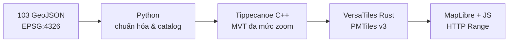

<div align="center">
  <a href="https://webgis-vinhlong.github.io/layer/">
    
  </a>
</div>

<p align="center">
  <strong>WebGIS vector hiệu năng cao cho dữ liệu hạ tầng và hành chính tỉnh Vĩnh Long</strong>
</p>

<p align="center">
  <a href="https://webgis-vinhlong.github.io/layer/"><b>🗺️ Mở WebGIS</b></a>
  ·
  <a href="#-khởi-chạy-nhanh">Khởi chạy</a>
  ·
  <a href="#-kiến-trúc-tối-ưu">Kiến trúc</a>
  ·
  <a href="#-giấy-phép">Giấy phép</a>
</p>

<p align="center">
  <a href="README.md">Tiếng Việt</a> |
  <a href="README_EN.md">English</a> |
  <a href="README_ZH.md">中文</a>
</p>

<p align="center">
  
  
  
  
  
  <a href="https://github.com/webgis-vinhlong/layer/actions/workflows/ci.yml">
    
  </a>
</p>

---

## 🌊 Giới thiệu

**Vĩnh Long Layer Atlas** hợp nhất 103 lớp GeoJSON thành một kho vector
[PMTiles](https://github.com/protomaps/PMTiles) duy nhất. Trình duyệt chỉ đọc đúng
dải byte cần thiết qua HTTP Range, nên không cần máy chủ tile, cơ sở dữ liệu hay khóa API.

Ứng dụng được phát triển bởi **Long Ngo**, hướng đến một nền WebGIS công khai, dễ triển khai
trên GitHub Pages và đủ rõ ràng để cơ quan, trường học, nhà nghiên cứu hoặc cộng đồng tiếp tục
mở rộng.

> [!TIP]
> Trải nghiệm ngay tại **[webgis-vinhlong.github.io/layer](https://webgis-vinhlong.github.io/layer/)**.
> Nhấp một ký hiệu trên bản đồ để xem đầy đủ thuộc tính đối tượng.

## ✨ Điểm nổi bật

| Khả năng | Mô tả |
|---|---|
| 🧭 Giao diện GIS chuyên nghiệp | Sidebar nhóm lớp, tìm kiếm không dấu, bật/tắt nhanh, phóng đến phạm vi lớp và bảng thuộc tính |
| 🧱 103 lớp vector | 19 nhóm chuyên đề: hành chính, giao thông, nước sạch, y tế, giáo dục, thủy lợi, viễn thông… |
| ⚡ Một tệp PMTiles | 7,3 MiB, MVT nén gzip, zoom 7–16; tải theo vùng nhìn thay vì tải toàn bộ 18 MiB GeoJSON |
| 🎨 Ký hiệu theo tỷ lệ | Điểm, đường, vùng có màu theo nhóm; kích thước, độ rộng và độ trong suốt biến đổi theo mức zoom |
| 🛰️ Ba nền bản đồ | CARTO sáng, CARTO tối và Esri World Imagery; chuyển nền mà không tải lại dữ liệu chuyên đề |
| 🔎 Truy vấn an toàn | Thuộc tính được dựng bằng DOM/text escaping; hiển thị tối đa 40 trường có ý nghĩa |
| 📱 Responsive | Sidebar dạng ngăn kéo trên điện thoại, bảng thuộc tính dạng bottom sheet, hỗ trợ bàn phím và reduced motion |
| 🔁 Có thể tái tạo | Pipeline Python → Tippecanoe C++ → VersaTiles Rust → PMTiles; Go/C++/Rust kiểm tra độc lập trong CI |

## 📊 Thống kê dữ liệu

| Chỉ số | Giá trị |
|---|---:|
| Tệp GeoJSON nguồn | 103 |
| Nhóm chuyên đề | 19 |
| Đối tượng nguồn | 36.643 |
| Đối tượng hợp lệ được lập bản đồ | 35.017 |
| Điểm / đường / vùng | 30.221 / 4.569 / 227 |
| Tọa độ sai tỷ lệ được chuẩn hóa | 1.499 |
| Hình học lỗi được cách ly | 1.626 |
| Hệ tọa độ đầu vào | EPSG:4326 |
| Phạm vi | 105.6850–106.7821°E, 9.5339–10.6242°N |

Không xóa âm thầm dữ liệu lỗi: pipeline ghi rõ số lượng theo từng lớp trong
[`data/source-manifest.json`](data/source-manifest.json). Tọa độ chỉ được sửa khi phép chia
theo lũy thừa 10 đưa điểm về miền hợp lý của Vĩnh Long; trường hợp còn mơ hồ được cách ly.

## 🧠 Kiến trúc tối ưu



- **Python** xác thực FeatureCollection, làm sạch thuộc tính, sửa lỗi tỷ lệ tọa độ có thể xác
  định và tạo ba luồng GeoJSONL.
- **C++** tạo tile vector đa mức zoom bằng Tippecanoe; công cụ `geometry_sanity.cpp` kiểm tra
  đủ 35.017 đối tượng sau chuẩn hóa.
- **Rust** chuyển MBTiles sang PMTiles v3 bằng lõi native VersaTiles và kiểm tra bất biến catalog.
- **Go** đọc trực tiếp header nhị phân PMTiles, thống kê directory/tile và tính SHA-256.
- **JavaScript** kết nối giao thức `pmtiles://`, quản lý lớp và dựng UI MapLibre.

## 🚀 Khởi chạy nhanh

Yêu cầu: Python 3.10+ và Node.js 20+.

```bash
git clone https://github.com/webgis-vinhlong/layer.git
cd layer
npm install
npm run serve
```

Mở `http://localhost:4173`. Không mở trực tiếp `index.html` bằng `file://`, vì trình duyệt cần
HTTP Range để đọc PMTiles.

### Tái tạo toàn bộ PMTiles

```bash
npm run build
npm run verify
```

Quy trình build sử dụng binary Tippecanoe đóng gói sẵn cho nền tảng hỗ trợ. Có thể chỉ định
Tippecanoe hệ thống bằng biến `TIPPECANOE=/duong-dan/tippecanoe`.

### Kiểm tra độc lập

```bash
# C++
g++ -std=c++20 -O2 native/geometry_sanity.cpp -o build/geometry_sanity
build/geometry_sanity build/points.geojsonl build/lines.geojsonl build/polygons.geojsonl

# Rust
rustc -O native/catalog_audit.rs -o build/catalog_audit
build/catalog_audit data/catalog.json

# Go
go run native/pmtiles_inspect.go data/vinhlong-layers.pmtiles
```

## 🗂️ Cấu trúc repository

```text
.
├── index.html                 # Ứng dụng WebGIS
├── assets/                    # UI, JavaScript, logo và favicon
├── data/
│   ├── geojson/               # 103 tệp nguồn đã khôi phục
│   ├── catalog.json           # Catalog dùng cho giao diện
│   ├── source-manifest.json   # Hash, số lượng và lỗi theo lớp
│   └── vinhlong-layers.pmtiles
├── tools/                     # Pipeline Python/Node
├── native/                    # Bộ kiểm tra Go/Rust/C++
└── .github/workflows/         # CI và GitHub Pages
```

## 🧩 Tùy biến

- Màu và biểu tượng nhóm nằm trong `data/source-catalog.json`.
- Lớp nổi bật khi mở trang nằm trong `APP.featuredLayerIds` tại `assets/app.js`.
- Kiểu điểm/đường/vùng nằm trong hàm `addThematicLayers()`.
- Muốn thêm lớp: đặt GeoJSON vào `data/geojson/`, cập nhật catalog nguồn rồi chạy
  `npm run build`.

## 🛡️ Chất lượng, bảo mật và riêng tư

- Không có backend, cookie phân tích hay khóa API.
- Định vị chỉ chạy khi người dùng chủ động bấm **Vị trí** và cấp quyền cho trình duyệt.
- Thuộc tính dữ liệu không được chèn trực tiếp dưới dạng HTML.
- Dependencies được khóa phiên bản; GitHub Actions kiểm tra catalog, PMTiles và các luồng hình học.
- Vui lòng báo lỗ hổng theo [`SECURITY.md`](SECURITY.md), không đưa dữ liệu nhạy cảm vào issue công khai.

## 🤝 Đóng góp

Đóng góp về ký hiệu bản đồ, làm sạch dữ liệu, khả năng truy cập và hiệu năng đều được chào đón.
Đọc [`CONTRIBUTING.md`](CONTRIBUTING.md), tạo nhánh riêng và gửi pull request kèm mô tả lớp dữ liệu
đã thay đổi.

## 📜 Giấy phép

**Mã nguồn** được phát hành theo [MIT License](LICENSE), bản quyền © 2026 **Long Ngo**.

Dữ liệu chuyên đề ghi nguồn `hatang.vinhlong.gov.vn`. Giấy phép MIT của repository không tự động
thay thế điều khoản của đơn vị cung cấp dữ liệu; người tái sử dụng cần kiểm tra quyền, độ chính xác
và yêu cầu ghi công của nguồn dữ liệu. Xem thêm [`NOTICE.md`](NOTICE.md).

---

<p align="center">
  Thiết kế và phát triển với tinh thần dữ liệu mở bởi <strong>Long Ngo</strong><br>
  <sub>Vĩnh Long Layer Atlas · Open GIS · MIT</sub>
</p>
