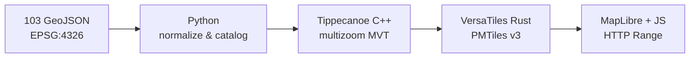

<div align="center">
  <a href="https://webgis-vinhlong.github.io/layer/">
    
  </a>
</div>

<p align="center"><strong>A high-performance vector WebGIS for Vĩnh Long infrastructure and administrative data</strong></p>

<p align="center">
  <a href="https://webgis-vinhlong.github.io/layer/"><b>🗺️ Launch WebGIS</b></a>
  · <a href="#-quick-start">Quick start</a>
  · <a href="#-optimized-architecture">Architecture</a>
  · <a href="#-license">License</a>
</p>

<p align="center">
  <a href="README.md">Tiếng Việt</a> |
  <a href="README_EN.md">English</a> |
  <a href="README_ZH.md">中文</a>
</p>

<p align="center">
  
  
  
  
  
</p>

---

## 🌊 Overview

**Vĩnh Long Layer Atlas** consolidates 103 GeoJSON layers into a single
[PMTiles](https://github.com/protomaps/PMTiles) vector archive. A browser fetches only the byte
ranges needed for the current viewport, so the application requires no tile server, spatial
database, or API key.

Developed by **Long Ngo**, the project provides a transparent WebGIS foundation that can be
deployed on GitHub Pages and extended by public agencies, schools, researchers, and open-data
communities.

> [!TIP]
> Try the live application at
> **[webgis-vinhlong.github.io/layer](https://webgis-vinhlong.github.io/layer/)**.
> Click any rendered symbol to inspect its attributes.

## ✨ Highlights

| Capability | Details |
|---|---|
| 🧭 Professional GIS interface | Grouped layer panel, accent-insensitive search, quick filters, fit-to-layer, and feature inspector |
| 🧱 103 vector layers | 19 themes including administration, transportation, clean water, health, education, irrigation, and telecommunications |
| ⚡ One PMTiles archive | 7.3 MiB, gzip-compressed MVT, zoom 7–16; viewport-range loading instead of downloading all 18 MiB of GeoJSON |
| 🎨 Scale-aware symbology | Category colors with point radius, line width, label visibility, and opacity changing by zoom |
| 🛰️ Three basemaps | CARTO Light, CARTO Dark, and Esri World Imagery without reloading thematic data |
| 📱 Responsive and accessible | Mobile drawer, bottom-sheet inspector, keyboard controls, focus states, and reduced-motion support |
| 🔁 Reproducible pipeline | Python → Tippecanoe C++ → VersaTiles Rust → PMTiles, independently audited with Go/C++/Rust |

## 📊 Dataset summary

| Metric | Value |
|---|---:|
| Source GeoJSON files | 103 |
| Thematic groups | 19 |
| Source features | 36,643 |
| Valid mapped features | 35,017 |
| Points / lines / polygons | 30,221 / 4,569 / 227 |
| Corrected coordinate scale errors | 1,499 |
| Quarantined invalid geometries | 1,626 |
| Input coordinate reference system | EPSG:4326 |

The pipeline never silently drops questionable data. Per-layer counts, SHA-256 hashes, and invalid
geometry totals are recorded in [`data/source-manifest.json`](data/source-manifest.json).
Coordinates are corrected only when a power-of-ten adjustment places them inside a defensible
Vĩnh Long extent; ambiguous geometries are quarantined.

## 🧠 Optimized architecture



- **Python** validates FeatureCollections, cleans attributes, normalizes defensible coordinates,
  and creates three GeoJSONL streams.
- **C++** produces multi-zoom MVT with Tippecanoe; a standalone validator confirms all 35,017
  normalized features.
- **Rust** converts MBTiles to PMTiles v3 with the native VersaTiles engine and audits catalog
  invariants.
- **Go** reads the binary PMTiles header and reports directory statistics plus SHA-256.
- **JavaScript** registers the `pmtiles://` protocol, manages layer state, and renders MapLibre UI.

## 🚀 Quick start

Requirements: Python 3.10+ and Node.js 20+.

```bash
git clone https://github.com/webgis-vinhlong/layer.git
cd layer
npm install
npm run serve
```

Open `http://localhost:4173`. Do not use a `file://` URL because PMTiles relies on HTTP Range
requests.

Rebuild and verify the complete archive:

```bash
npm run build
npm run verify
```

Set `TIPPECANOE=/path/to/tippecanoe` to use a system Tippecanoe executable.

## 🗂️ Repository layout

```text
.
├── index.html                 # WebGIS application
├── assets/                    # UI, JavaScript, logo, favicon
├── data/
│   ├── geojson/               # 103 recovered source files
│   ├── catalog.json           # Runtime catalog
│   ├── source-manifest.json   # Hashes, counts, data-quality report
│   └── vinhlong-layers.pmtiles
├── tools/                     # Python/Node build pipeline
├── native/                    # Go/Rust/C++ validators
└── .github/workflows/         # CI and GitHub Pages
```

## 🛡️ Security and privacy

The app has no backend, analytics cookies, or API keys. Geolocation runs only after the user
presses **Location** and grants browser permission. Dataset properties are escaped before display.
Please follow [`SECURITY.md`](SECURITY.md) when reporting a vulnerability.

## 🤝 Contributing

Improvements to cartographic styling, data cleaning, accessibility, and performance are welcome.
Read [`CONTRIBUTING.md`](CONTRIBUTING.md), work in a focused branch, and describe affected layers
in the pull request.

## 📜 License

The **source code** is released under the [MIT License](LICENSE), copyright © 2026 **Long Ngo**.

The thematic data is attributed to `hatang.vinhlong.gov.vn`. The repository's MIT license does not
supersede the data provider's terms; downstream users must verify reuse rights, accuracy, and
attribution requirements. See [`NOTICE.md`](NOTICE.md).

---

<p align="center">
  Designed and developed in the spirit of open geospatial data by <strong>Long Ngo</strong><br>
  <sub>Vĩnh Long Layer Atlas · Open GIS · MIT</sub>
</p>
