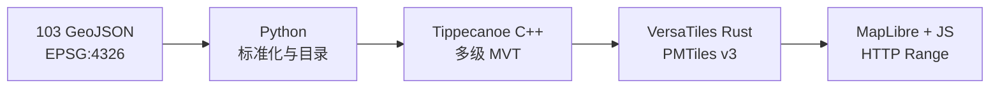

<div align="center">
  <a href="https://webgis-vinhlong.github.io/layer/">
    
  </a>
</div>

<p align="center"><strong>面向越南永隆省基础设施与行政数据的高性能矢量 WebGIS</strong></p>

<p align="center">
  <a href="https://webgis-vinhlong.github.io/layer/"><b>🗺️ 打开 WebGIS</b></a>
  · <a href="#-快速开始">快速开始</a>
  · <a href="#-优化架构">系统架构</a>
  · <a href="#-许可证">许可证</a>
</p>

<p align="center">
  <a href="README.md">Tiếng Việt</a> |
  <a href="README_EN.md">English</a> |
  <a href="README_ZH.md">中文</a>
</p>

<p align="center">
  
  
  
  
  
</p>

---

## 🌊 项目简介

**Vĩnh Long Layer Atlas（永隆图层地图集）** 将 103 个 GeoJSON 图层合并为一个
[PMTiles](https://github.com/protomaps/PMTiles) 矢量归档。浏览器仅通过 HTTP Range
读取当前视野所需的字节，因此无需瓦片服务器、空间数据库或 API 密钥。

项目由 **Long Ngo** 开发，目标是提供一套透明、可复现、可直接部署到 GitHub Pages
的 WebGIS 基础，方便政府机构、学校、研究人员与开放数据社区继续扩展。

> [!TIP]
> 在线体验：**[webgis-vinhlong.github.io/layer](https://webgis-vinhlong.github.io/layer/)**。
> 点击地图符号即可查看对象属性。

## ✨ 核心特性

| 能力 | 说明 |
|---|---|
| 🧭 专业 GIS 界面 | 分组图层面板、越南语无重音搜索、快速筛选、缩放至图层范围和属性查看器 |
| 🧱 103 个矢量图层 | 19 个专题，包括行政、交通、供水、医疗、教育、水利和通信等 |
| ⚡ 单一 PMTiles 文件 | 7.3 MiB、gzip 压缩 MVT、缩放级别 7–16；按视野读取而不是下载全部 18 MiB GeoJSON |
| 🎨 随比例尺变化的符号 | 按专题着色，点半径、线宽、标签可见性和透明度随缩放级别变化 |
| 🛰️ 三种底图 | CARTO 浅色、CARTO 深色与 Esri 卫星影像；切换时无需重新加载专题数据 |
| 📱 响应式与无障碍 | 移动端抽屉、底部属性面板、键盘操作、焦点样式与减少动画支持 |
| 🔁 可复现流水线 | Python → Tippecanoe C++ → VersaTiles Rust → PMTiles，并使用 Go/C++/Rust 独立校验 |

## 📊 数据概览

| 指标 | 数值 |
|---|---:|
| 源 GeoJSON 文件 | 103 |
| 专题分组 | 19 |
| 源要素 | 36,643 |
| 有效地图要素 | 35,017 |
| 点 / 线 / 面 | 30,221 / 4,569 / 227 |
| 已修复的坐标数量级错误 | 1,499 |
| 已隔离的无效几何 | 1,626 |
| 输入坐标参考系 | EPSG:4326 |

流水线不会静默丢弃问题数据。每个图层的数量、SHA-256 与无效几何统计均写入
[`data/source-manifest.json`](data/source-manifest.json)。只有当 10 的幂次缩放可以把坐标
恢复到合理的永隆范围时才会自动修复；其余不确定几何将被隔离。

## 🧠 优化架构



- **Python** 验证 FeatureCollection、清理属性、修复可判定坐标并生成三份 GeoJSONL。
- **C++** 通过 Tippecanoe 生成多级矢量瓦片，并独立确认 35,017 个标准化要素。
- **Rust** 使用原生 VersaTiles 引擎将 MBTiles 转换为 PMTiles v3，并检查目录不变量。
- **Go** 直接读取 PMTiles 二进制头，输出目录统计与 SHA-256。
- **JavaScript** 注册 `pmtiles://` 协议、管理图层状态并渲染 MapLibre 界面。

## 🚀 快速开始

环境要求：Python 3.10+、Node.js 20+。

```bash
git clone https://github.com/webgis-vinhlong/layer.git
cd layer
npm install
npm run serve
```

打开 `http://localhost:4173`。请勿使用 `file://` 直接打开页面，因为 PMTiles 需要 HTTP
Range 请求。

重新构建并验证归档：

```bash
npm run build
npm run verify
```

可通过 `TIPPECANOE=/path/to/tippecanoe` 指定系统中的 Tippecanoe。

## 🗂️ 仓库结构

```text
.
├── index.html                 # WebGIS 应用
├── assets/                    # UI、JavaScript、Logo 与图标
├── data/
│   ├── geojson/               # 103 个恢复后的源文件
│   ├── catalog.json           # 运行时图层目录
│   ├── source-manifest.json   # 哈希、数量与质量报告
│   └── vinhlong-layers.pmtiles
├── tools/                     # Python/Node 构建流水线
├── native/                    # Go/Rust/C++ 校验工具
└── .github/workflows/         # CI 与 GitHub Pages
```

## 🛡️ 安全与隐私

应用没有后端、分析 Cookie 或 API 密钥。只有用户点击“位置”并授予浏览器权限后才会
执行定位。数据属性在显示前会进行转义。报告安全问题请遵循
[`SECURITY.md`](SECURITY.md)。

## 🤝 参与贡献

欢迎改进地图符号、数据清洗、无障碍与性能。请先阅读
[`CONTRIBUTING.md`](CONTRIBUTING.md)，在独立分支完成修改，并在 Pull Request 中说明
受影响的图层。

## 📜 许可证

**源代码**依据 [MIT License](LICENSE) 发布，版权所有 © 2026 **Long Ngo**。

专题数据来源标注为 `hatang.vinhlong.gov.vn`。本仓库的 MIT 许可证不会替代数据提供方
的条款；下游用户应自行确认复用权、准确性与署名要求。详见 [`NOTICE.md`](NOTICE.md)。

---

<p align="center">
  由 <strong>Long Ngo</strong> 以开放地理数据精神设计与开发<br>
  <sub>Vĩnh Long Layer Atlas · Open GIS · MIT</sub>
</p>
